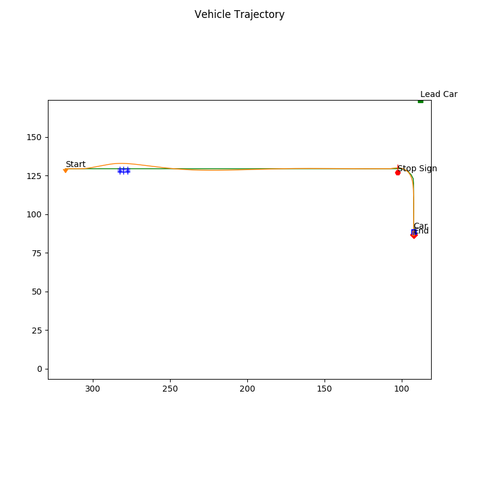
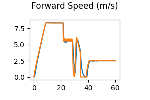
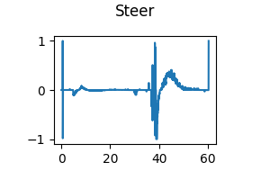

# Implementing motion planner in Carla to avoid both static and dynamic obstacles

The goal of this project will be to have a functional motion planning stack that can avoid both static and dynamic obstacles while tracking the center line of a lane, while also handling stop signs. To accomplish this, we will have to implement behavioral planning logic, as well as static collision checking, path selection, and velocity profile generation.

## Behaviour Planning Logic
In this part of the project, we will implement the behavioural logic required to handle a stop sign. we will be implementing a state machine that transitions between lane following, deceleration to the stop sign, staying stopped, and back to lane following, when it encounters a stop sign. All of the code for the behavioural planner is contained in behavioural_planner.py.

To do this, we will first implement the helper functions get_closest_index() and get_goal_index(). These will let the behavioural planner know where it is relative to the global path, and to compute the current goal point from the global path. Once these are done, we will then implement the transition_state() function, which contains the behavioural state machine logic.

## Path Generation
For the path generation section of the project, the majority of the mathematical code for generating spiral paths is given. However, we will need to compute the goal state set (the set of goal points to plan paths to before path selection) using the get_goal_state_set() function, as well as some of the path generation helper functions. In particular, we will implement thetaf(), which computes the yaw of the car at a set of arc length points for a given spiral, optimize_spiral(), which sets up the optimization problem for a given path. Finally, once the optimization is complete, the resulting spiral will be sampled to generate the path. This functionality needs to be implemented in sample_spiral(). The required details about each of these functions are given in the code comments in the files local_planner.py and path_optimizer.py.

## Static Collision Checking
For this part of the motion planner, we will be editing collision_checker.py. In particular, we're going to be implementing circle-based collision checking on our computed path set using the collision_check() function. we will implement the circle location calculation for each point on the path.

## Path Selection
The path selection portion of the project involves us evaluating an objective function over the generated path set to select the best path. The goal of this section is to eliminate paths that are in collision with static obstacles, and to select paths that both track the centerline of the global path. To encourage robust obstacle avoidance, we will also need to add a term that penalizes how close the planned path is to other paths in the path set that are in collision with a static obstacle. we will implement path selection in the select_best_path_index() function within collision_checker.py.

## Velocity Profile Generation
The last step of the project is velocity profile generation. This velocity planner will not handle all edge cases, but will handle stop signs, lead dynamic obstacles, as well as nominal lane maintenance. This is all captured in the compute_velocity_profile() function in velocity_planner.py. we will be implementing the physics functions at the end of the file which will be used for velocity planning.

